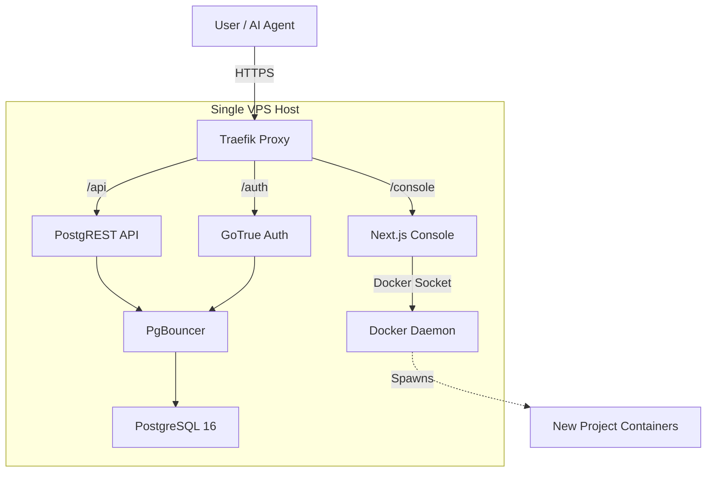

# Branch Fullstack Architecture Document

## 1. Introduction

This document outlines the complete fullstack architecture for **Branch**, including backend systems (Docker infrastructure, PostgREST), frontend implementation (Next.js Console), and their integration. It serves as the single source of truth for AI-driven development, ensuring consistency across the entire technology stack.

This unified approach combines what would traditionally be separate backend and frontend architecture documents, streamlining the development process for this "Infrastructure-as-Code" application where these concerns are intrinsically linked.

### 1.1 Starter Template or Existing Project
**Status:** N/A - Greenfield project.
**Context:** The project will be initialized as a Monorepo from scratch, incorporating a standard Next.js 14 setup for the Console and a Docker Compose based infrastructure for the backend services, as defined in the PRD.

### 1.2 Change Log
| Date | Version | Description | Author |
| :--- | :--- | :--- | :--- |
| 2026-01-07 | 0.1 | Initial Draft | Winston (Architect) |

## 2. High Level Architecture

### 2.1 Technical Summary
Branch employs a **Distributed Monolith (Containerized Microservices on Single Host)** architecture. All components (Database, API, Auth, Console) run on a single VPS orchestrated via **Docker Compose**, ensuring strict isolation and rapid provisioning ("Time-to-Project" < 5s).
- **Frontend:** Next.js 14 (App Router) acting as the administration "Console".
- **Backend:** PostgreSQL 16 + PostgREST + PgBouncer stack for a performant, standardized API.
- **Routing:** Traefik handles routing (Reverse Proxy) and automatic SSL termination for all services.
- **Integration:** The Console communicates with the backend stack via the internal Docker network (for provisioning) and via the public API (for data operations).

### 2.2 Platform and Infrastructure Choice
- **Platform:** **Self-Hosted VPS** (Ubuntu 22.04 LTS or 24.04 LTS).
- **Key Services:** Docker Engine, Docker Compose.
- **Regions:** User-defined (Single Region Vertical Scaling).

### 2.3 Repository Structure
**Structure:** Monorepo
**Monorepo Tool:** TurboRepo (Recommended for Next.js ecosystem) or NPM Workspaces.
**Package Organization:**
- `apps/web`: The Next.js Console application.
- `infrastructure`: Docker Compose templates, initialization scripts, Traefik config.
- `packages/shared`: Shared TypeScript types (if any), shared configs.

### 2.4 High Level Architecture Diagram


### 2.5 Architectural Patterns
- **Gateway Pattern (Traefik):** Single entry point handling SSL and routing by subdomain/path. _Rationale:_ Simplifies security and service exposure management.
- **Sidecar / Ambassador (PgBouncer):** Connection pool manager sitting in front of the DB. _Rationale:_ Critical for supporting high concurrency from AI agents and serverless functions.
- **Automatic API Generation (PostgREST):** Immediate exposure of DB as REST API. _Rationale:_ Meets the "AI-Native" requirement without manual controller coding.

## 3. Tech Stack

### 3.1 Technology Stack Table
| Category | Technology | Version | Purpose | Rationale |
| :--- | :--- | :--- | :--- | :--- |
| **Frontend Language** | TypeScript | 5.x | Type Safety | Robustness and developer experience. |
| **Frontend Framework** | Next.js | 14 (App Router) | Console Application | Server Components, Routing, and performance. |
| **UI Component Library** | Shadcn/UI (Radix) | Latest | User Interface | "Premium" look, accessible, easy customization. |
| **State Management** | TanStack Query | 5.x | Server State | Efficient data fetching and caching for dashboard. |
| **Client State** | Zustand | 4.x | UI State | Simple, lightweight global store. |
| **Backend Language** | Bash / Node.js | - | Orchestration | Bash for Docker scripts, Node.js for Console logic. |
| **Database** | PostgreSQL | 16 | Core Database | Robustness, JSON support, standard. |
| **API Engine** | PostgREST | Latest | REST API | Automatic API generation from schema. |
| **Connection Pool** | PgBouncer | Latest | Pooling | High concurrency support for AI agents. |
| **Authentication** | GoTrue | Latest | Auth Service | Integrated with Postgres RLS. |
| **Admin SQL Client** | postgres.js | Latest | Admin Operations | Lightweight, fast execution of raw SQL for migrations. |
| **Container Engine** | Docker Engine | Latest | Runtime | Industry standard for containerization. |
| **Orchestrator** | Docker Compose | V2 | Service Management | Simple multi-container orchestration for single host. |
| **Reverse Proxy** | Traefik | v3 | Ingress / SSL | Automatic SSL (Let's Encrypt) and dynamic routing. |
| **Testing** | Jest / Supertest | Latest | API/Unit Testing | Standard testing tools for Node.js ecosystem. |

## 4. Data Models (Meta-Layer)

These models are used by the Console to manage the infrastructure. They are stored in a local SQLite database (via Prisma/Better-SQLite) within the Console application for the MVP.

### 4.1 Project Model
**Purpose:** Represents a deployed database instance.
**Key Attributes:**
- `id`: UUID - Unique identifier
- `name`: string - Display name
- `status`: enum - 'provisioning' | 'online' | 'offline' | 'error'
- `port_mapping`: integer - Internal port assigned on the host
- `created_at`: timestamp - Creation date
- `db_password_hash`: string - Encrypted storage of the DB password (if managed)

### 4.2 Console User Model
**Purpose:** The administrator of the VPS accessing the console.
**Key Attributes:**
- `id`: UUID
- `email`: string
- `password_hash`: string
- `last_login`: timestamp

### 4.3 Relationships
- **Console User** has many **Projects**.

## 5. API Specification

### 5.1 Branch Management API (Internal)
This API is served by the Next.js Console (`/api/projects`, `/api/admin`) and is used by the frontend and authorized AI agents to manage the infrastructure.

**Specification:**
```yaml
openapi: 3.0.0
info:
  title: Branch Management API
  version: 1.0.0
  description: API for provisioning and managing Branch projects.
paths:
  /api/projects:
    get:
      summary: List all projects
      responses:
        '200':
          description: List of projects
    post:
      summary: Provision a new project
      requestBody:
        content:
          application/json:
            schema:
              type: object
              properties:
                name:
                  type: string
                dbPassword:
                  type: string
  /api/admin/query:
    post:
      summary: Execute raw SQL on a specific project (AI Agent Endpoint)
      security:
        - BearerAuth: []
      requestBody:
        content:
          application/json:
            schema:
              type: object
              required:
                - projectId
                - query
              properties:
                projectId:
                  type: string
                  format: uuid
                query:
                  type: string
                  description: Raw SQL query to execute
      responses:
        '200':
          description: Query results or error
```

### 5.2 Project Data API (Public)
Each project exposes a full REST API generated by PostgREST.
**URL Pattern:** `https://{project-id}.{domain}/api`
**Documentation:** Automatically available at `https://{project-id}.{domain}/api-docs` (Swagger UI).

## 6. Components

### 6.1 Component Diagram (C4 Container)
```mermaid
graph TB
    User[User]
    Agent[AI Agent]
    
    subgraph VPS
        Traefik[Traefik Proxy]
        
        subgraph ConsoleApp [Console App]
            NextJS[Next.js Server]
            SQLite[(Meta DB)]
        end
        
        subgraph ProjectStack [Project Stack (One per Project)]
            PgBouncer[PgBouncer]
            PostgREST[PostgREST]
            Postgres[(PostgreSQL)]
            GoTrue[GoTrue Auth]
        end
    end
    
    User -->|HTTPS| Traefik
    Agent -->|HTTPS| Traefik
    
    Traefik -->|/console| NextJS
    Traefik -->|/api| PostgREST
    
    NextJS -->|Reads/Writes| SQLite
    NextJS -->|Manage| ProjectStack
    
    PostgREST --> PgBouncer
    PgBouncer --> Postgres
```

### 6.2 Key Components
- **Console (Next.js):** The control plane. Handles UI, auth for admin, and provisioning logic.
- **Orchestrator (Node.js Service):** Part of Next.js API routes. Responsible for generating `docker-compose.yml` files and running `docker compose up`.
- **Traefik:** The dynamic router. Watches Docker socket to automatically route `project-id.domain` to the correct container.
- **Project Stack:** The standard deployment unit. Contains Postgres, PostgREST, and PgBouncer pre-configured.

## 7. Deployment Architecture

### 7.1 Deployment Strategy
**Host:** Single VPS.
**Method:** Git-based deployment for the Console, Docker-based provisioning for projects.
- **Console Update:** `git pull && npm run build && pm2 restart console`
- **Project Provisioning:** The Console generates a folder `/projects/{id}`, writes a `.env` and `docker-compose.yml`, and executes `docker compose up -d`.

### 7.2 CI/CD Pipeline
- **GitHub Actions:**
    - Lint & Test (Jest).
    - Build Next.js app.
    - (Optional) Build & Push Docker image for Console if containerized.

## 8. Security and Performance

### 8.1 Security
- **Isolation:** Each project runs in its own set of Docker containers on a dedicated internal network.
- **SSL:** Automatic via Let's Encrypt (Traefik).
- **Admin API:** Protected by a high-entropy `SERVICE_ROLE_KEY`.
- **Database Access:** Direct DB port (5432) is **NOT** exposed to the internet. Access is only via PostgREST (HTTP) or the Admin API (HTTP).

### 8.2 Performance
- **Connection Pooling:** PgBouncer is mandatory to support serverless/AI workloads.
- **Resource Limits:** Docker containers will have CPU/RAM limits configured to prevent "noisy neighbor" issues.

## 9. Architect Checklist Results

### 9.1 Executive Summary
- **Overall Readiness:** **HIGH**. The architecture is solid, pragmatic, and directly addresses the unique constraint of "Single VPS Hosting" while enabling modern "AI-Native" features.
- **Project Type:** Full-stack (Infrastructure-heavy Backend + Next.js Frontend).
- **Key Strengths:**
    - **Simplicity:** The "Distributed Monolith" approach avoids Kubernetes complexity while keeping microservices isolation.
    - **AI-Readiness:** Native integration of PostgREST and Swagger ensures the primary persona (AI Agents) is first-class.
    - **Performance:** Inclusion of PgBouncer and Traefik demonstrates maturity regarding resource constraints.

### 9.2 Risk Assessment
| Risk | Severity | Mitigation |
| :--- | :--- | :--- |
| **Docker Socket Security** | High | The Console needs access to `/var/run/docker.sock`. Mitigation: Use a proxy or strictly limit the Console's permissions (e.g., using `tecnativa/docker-socket-proxy`). |
| **Disk Saturation** | Medium | Logs from 10+ projects can fill the VPS. Mitigation: Strict Docker logging drivers (json-file with max-size/max-file). |
| **Backup Reliability** | Medium | No external backup strategy detailed yet. Mitigation: Add a cron job to dump all DBs to S3. |

### 9.3 Recommendations
1.  **Must-Fix:** Implement `docker-socket-proxy` to prevent the Console from having root-equivalent access to the host.
2.  **Should-Fix:** Define a standard "Backup Strategy" (e.g., `pg_dump` to S3 every 6h).
3.  **Nice-to-Have:** Add a "System Monitor" view in the Console to see VPS CPU/RAM usage globally.

### 9.4 Final Verdict
**ARCHITECTURE APPROVED**. Ready for implementation phase.
