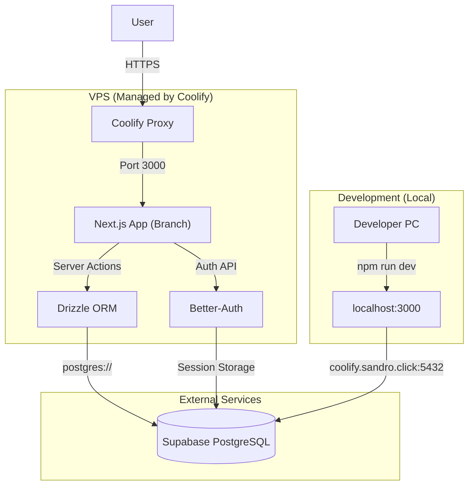

# 2. High Level Architecture

### 2.1 Technical Summary

Branch employs a **Managed Platform** architecture. The application runs on **Coolify** (self-hosted PaaS) with **Supabase PostgreSQL** as external database service.

- **Frontend/Backend:** Next.js 16+ (App Router) with Server Actions for data operations.
- **Database Access:** Drizzle ORM for type-safe queries and migrations.
- **Authentication:** Better-Auth for email/password and session management.
- **Deployment:** Git push to main branch triggers automatic deployment via Coolify.

### 2.2 Platform and Infrastructure Choice

| Component | Choice | Rationale |
|-----------|--------|-----------|
| **Deployment Platform** | Coolify (VPS) | Self-hosted PaaS, Git deploys, automatic SSL |
| **Database** | Supabase PostgreSQL | Managed PostgreSQL, external to app |
| **VPS Host** | Ubuntu 22.04/24.04 LTS | Coolify-managed Docker containers |

### 2.3 Repository Structure

**Structure:** Flat (No Monorepo)

```
Branch-v2/
├── app/                  # Next.js App Router pages & API routes
├── components/           # React components (Shadcn UI)
├── lib/                  # Core utilities (db, auth, schema)
├── drizzle/              # Generated migrations
├── public/               # Static assets
├── drizzle.config.ts     # Drizzle Kit configuration
└── package.json
```

### 2.4 High Level Architecture Diagram



### 2.5 Architectural Patterns

| Pattern | Implementation | Rationale |
|---------|----------------|-----------|
| **Server Actions** | Next.js App Router | No separate API needed, type-safe mutations |
| **ORM Pattern** | Drizzle ORM | Type-safe queries, auto-generated migrations |
| **Session-based Auth** | Better-Auth | Secure sessions, extensible providers |
| **Git-based Deploy** | Coolify | Push to main = deploy, zero-downtime |

### 2.6 Connection Modes

| Environment | Database Host | Access |
|-------------|---------------|--------|
| **Local Development** | `coolify.sandro.click:5432` | Internet connection |
| **Production (Coolify)** | Docker internal hostname | Docker network |