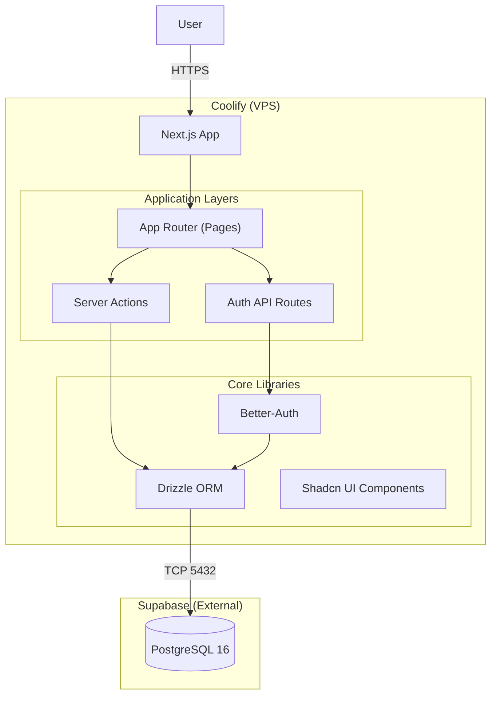

# 6. Components

### 6.1 Component Diagram (C4 Container)



### 6.2 Key Components

| Component | Technology | Responsibility |
|-----------|------------|----------------|
| **App Router** | Next.js 16+ | Page routing, layouts, SSR/SSG |
| **Server Actions** | Next.js | Data mutations, form handling |
| **Auth API** | Better-Auth | `/api/auth/[...all]` - login, signup, sessions |
| **ORM Layer** | Drizzle ORM | Database queries, schema definition |
| **UI Components** | Shadcn/UI | Buttons, forms, cards, dialogs |
| **Database** | Supabase PostgreSQL | Data persistence, user/session storage |

### 6.3 File Structure

```
lib/
├── db.ts           # Drizzle connection (getDb singleton)
├── schema.ts       # Schema index
├── auth-schema.ts  # user, session, account, verification tables
├── auth.ts         # Better-Auth configuration (getAuth)
├── auth-client.ts  # React client (signIn, signUp, useSession)
└── utils.ts        # Shadcn utilities (cn function)

app/
├── page.tsx                    # Home page
├── layout.tsx                  # Root layout
├── globals.css                 # Tailwind styles
└── api/auth/[...all]/route.ts  # Better-Auth handler
```