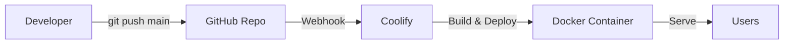

# 7. Deployment Architecture

### 7.1 Deployment Platform

**Platform:** Coolify (Self-hosted PaaS on VPS)

### 7.2 Deployment Flow



### 7.3 Deployment Configuration

| Setting | Value |
|---------|-------|
| **Trigger** | Git push to `main` branch |
| **Build Command** | `npm run build` |
| **Start Command** | `npm run start` |
| **Port** | 3000 |
| **SSL** | Automatic (Let's Encrypt via Coolify) |

### 7.4 Environment Variables

| Variable | Local (.env.local) | Production (Coolify) |
|----------|--------------------|-----------------------|
| `DATABASE_URL` | `postgres://...@coolify.sandro.click:5432/postgres` | Docker internal hostname |
| `BETTER_AUTH_SECRET` | Random secret | Same secret |
| `BETTER_AUTH_URL` | `http://localhost:3000` | Production URL |
| `NEXT_PUBLIC_APP_URL` | `http://localhost:3000` | Production URL |

### 7.5 Database Connection Strategy

```
┌─────────────────────────────────────┐
│          Local Development          │
│  npm run dev → coolify.sandro.click │
│         (Internet connection)       │
└─────────────────────────────────────┘

┌─────────────────────────────────────┐
│            Production               │
│  Docker Container → Docker Network  │
│       (Internal hostname)           │
└─────────────────────────────────────┘
```